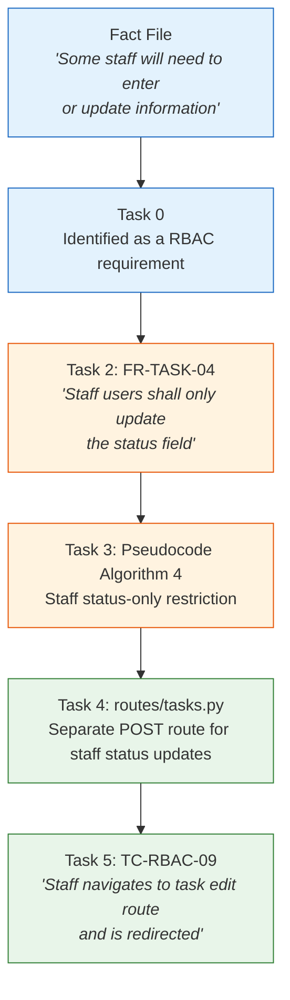

# Exam Decoder

## What This Document Is

The DPDD marking criteria tell you what areas are assessed. This document tells you **what good looks like** in each area, **what mistakes cost marks**, and **how to trace evidence through the whole project**.

---

## The Thread That Connects Everything: Traceability

The single most important pattern in this model answer is **traceability** — the ability to follow a thread from business need to code to test:

Every deliverable references the one before it. This isn't decoration — it's the evidence that you worked systematically, not randomly. An examiner can pick any feature and trace it from requirement to test case. If they can't, marks are lost.

Your own project should have this same property. If the examiner asks "where's the evidence that this feature was planned?" — can you point to a requirement ID, a design artefact, a commit, and a test case?

---

## Technical Audit & Analysis (20%)

| What the examiner looks for | What makes it Distinction-level |
|---|---|
| Understanding of the employer's problem | Problems are connected to specific business impacts, not just listed. Each problem has a proposed solution mapped against it. |
| Stakeholder identification | Five stakeholder groups identified, each with specific needs. Includes indirect users (clients) — showing breadth of thinking. |
| Project planning | 105-hour timeline matching the brief's phase allocation. Risk register with 8 specific risks. MoSCoW prioritisation showing what NOT to build, with justifications. |
| Technology choices | Every choice has a reason. Choices are connected to project constraints (team size, development time, deployment target). |
| Requirements gathering | 25 functional requirements with unique traceable IDs (FR-AUTH-01, etc.), each linked to a user story and business need from the fact file. 12 non-functional requirements covering security, performance, and accessibility. |

**What loses marks:**
- Listing requirements without traceable IDs — makes it impossible to reference them in design or testing
- Stating technology choices without justification ("I used Flask" vs "I chose Flask over Django because...")
- Skipping the risk register, or writing generic risks ("something might go wrong")
- A project plan that allocates 90% of time to coding — shows you didn't plan, you just started building

---

## Design (20%)

| What the examiner looks for | What makes it Distinction-level |
|---|---|
| System architecture | Three-layer design (routes, database, templates) with clear separation of concerns. Diagram shows how components *interact*, not just what exists. |
| Decomposition / module breakdown | Every leaf node has a FR-ID reference — traceability from design back to requirements. |
| Data flow diagrams | Level 0 context diagram AND Level 1 process breakdown. RBAC filter table showing how the same route behaves differently per role. |
| Database design (ERD) | ERD with relationships AND a full data dictionary showing types, constraints, defaults, and reasoning. SQL schema included to prove the design was implemented. |
| UI/UX design (wireframes) | Wireframes show **role variants** — the same page looks different for admin, manager, and staff. Screen flow diagram shows navigation between pages. |
| Interaction design | Sequence diagrams including RBAC rejection flows and the Post-Redirect-GET pattern. Shows runtime behaviour, not just static structure. |
| Algorithm design | Pseudocode with plain-English explanations. Includes conditional branching based on roles, multi-layer security checks. |
| Route design | Routes with RBAC columns, request/response descriptions, redirect targets, and flash message conventions. |
| Design justifications | "Chose X over Y because Z" format. Acknowledges trade-offs. Connects every choice to a project constraint. |

**What loses marks:**
- One wireframe per page without showing how different roles see different things
- An ERD without a data dictionary — the diagram alone doesn't show constraints or reasoning
- Skipping pseudocode — this is where you prove you planned the logic, not just the structure
- Design justifications that only state what you chose, not why you chose it over alternatives

---

## Development (40%)

This area is worth the most marks.

| What the examiner looks for | What makes it Distinction-level |
|---|---|
| Two programming languages | Both languages do substantial work. Python handles business logic, authentication, RBAC enforcement, database access, input validation, template rendering. Jinja2 templates handle conditional display, iteration, template inheritance, and role-based UI rendering. |
| Working CRUD operations | Full Create, Read, Update, Delete with validation, error handling, and role-based restrictions on every operation. |
| Authentication and security | Password hashing (scrypt), session management, login/logout. Same error message for "user not found" and "wrong password" (prevents username enumeration). |
| Role-based access control | Two lines of defence: backend decorators block unauthorised requests, database queries filter data by role. Jinja2 template conditionals render role-appropriate UI server-side. |
| Data validation | Server-side validation with flash messages for errors. All errors collected at once (not one-at-a-time). Parameterised queries prevent injection. Jinja2 auto-escaping prevents XSS. |
| Code quality | Detailed comments explaining what AND why. Consistent patterns across all modules. Blueprint architecture for modularity. Template inheritance for DRY layouts. |
| Development process | Developer notes with a real bug log. Commit history shows incremental, feature-by-feature development. |

**What loses marks:**
- Frontend-only access control — hiding elements in templates but not enforcing permissions with decorators
- String concatenation in SQL queries — a critical security vulnerability
- Storing passwords in plain text
- No error handling — crashes instead of returning helpful flash messages
- All code in one commit — shows no development process

---

## Evaluation (20%)

| What the examiner looks for | What makes it Distinction-level |
|---|---|
| Test plan with test cases | 47 test cases, each traced to a FR-ID. 25 RBAC boundary tests — testing what users CANNOT do, not just what they can. Bug log showing defects found and fixed. |
| User documentation | Written for end users in non-technical language. Covers every feature with step-by-step instructions. Permissions table matches the actual implemented RBAC rules. |
| Technical documentation | Written for developers. Covers installation, configuration, architecture, security, route reference, and known limitations. |
| Presentation | 15-minute structure with live demo. Demonstrates the system running as each role. Shows "View Page Source" proof and `curl` demonstration that RBAC is enforced server-side. |
| Reflective report | Personal and specific — describes real problems encountered and how they were solved. Acknowledges limitations honestly. Evaluates own performance against the original plan. |

**What loses marks:**
- Test cases that don't reference requirement IDs — no traceability
- Only testing "happy paths" — no tests for what should fail or be blocked
- User guide that doesn't match the actual system (e.g., says staff can create tasks when they can't)
- Reflective report that's generic ("I learned a lot") instead of specific ("I learned that template conditionals alone don't prevent direct POST requests, so I added server-side decorators that redirect unauthorised users")
- Presentation that describes the system instead of demonstrating it running
