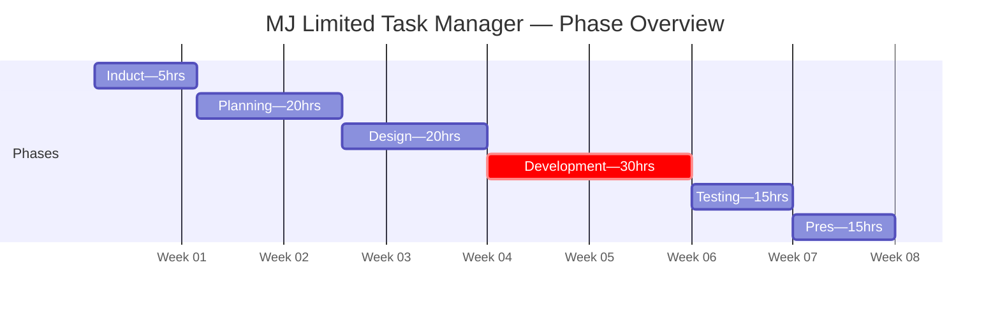

# Task 1: Project Initiation and Planning

## Project Plan

---

### 1. Project Scope and Objectives

#### Scope Statement
This project will deliver a **web-based staff portal** for MJ Limited that centralises task management, client records, and management reporting. The solution will use Python (Flask + Jinja2 templates) with server-rendered HTML pages, connected to an SQLite database.

The project is undertaken as a collaborative team effort by Junior Digital Product Developers, with each team member contributing across analysis, design, development, testing, and documentation.

#### What Is In Scope
- User authentication with role-based access control (Admin, Manager, Staff)
- Task management — create, read, update, delete work items with assignment and tracking
- Client management — maintain a central client database with relationship tracking
- Management dashboard with role-filtered visual charts
- File attachments on tasks (with type and size validation)
- Search and filtering across tasks and clients
- Responsive design for desktop and tablet
- Comprehensive documentation (technical and end-user)

#### What Is Out of Scope
- Real-time collaboration (WebSockets)
- Email notifications
- Integration with third-party accounting or HR software
- Mobile native application
- Advanced analytics or machine learning
- CSV/report export (documented as Should Have for future iteration)

#### Objectives
| # | Objective | Success Measure | Traced to Brief |
|---|---|---|---|
| 1 | Replace spreadsheet-based task tracking | Staff can create, assign, and track tasks through the portal | Fact File: "Inefficient tracking of client work and internal tasks" |
| 2 | Centralise client information | All client data stored in one place, accessible by relevant staff | Fact File: "Duplication and inconsistency of data across departments" |
| 3 | Provide management oversight | Dashboard shows real-time summary of tasks, workload, and clients | Fact File: "Limited visibility of workload and progress for managers" |
| 4 | Implement appropriate security | Role-based access prevents unauthorised data access | Fact File: "Students should consider how access levels are managed" |
| 5 | Deliver within allocated development hours | Working prototype with all Must Have features complete | Project Brief: 30 hours allocated for development phase |

---

### 2. MoSCoW Prioritisation

Before planning a timeline we need to know what we are building — and, critically, what we are NOT building. MoSCoW prioritisation draws a clear line so the 30-hour development budget is spent on features that matter most.

#### ✅ Must Have (will be built within 30 development hours)
- User authentication with hashed passwords and session management
- Role-based access control (admin, manager, staff) with backend enforcement
- Task management (CRUD) with assignment, status tracking, and role-filtered views
- Client management (CRUD) with role-restricted create/edit/delete
- Dashboard with role-filtered summary statistics and Chart.js visualisations
- File attachments on tasks (upload, download, delete with validation)
- Search and filtering across tasks and clients
- Responsive layout for desktop and tablet
- Server-side and client-side data validation

#### 🔶 Should Have (documented but not built in this iteration)
- CSV/report export for management
- Pagination on list views (for scalability)
- User management interface (currently seed-data only)

#### 🔷 Could Have (identified as beneficial)
- Activity/audit log for tracking changes
- Email notifications for task assignments

#### ❌ Won't Have (explicitly excluded with justification)
- Real-time collaboration (requires WebSockets — too complex for 30 development hours)
- Third-party integrations (no existing systems to integrate with — fact file confirms standalone)
- Mobile native app (web responsive design covers tablet/mobile needs adequately)
- Advanced analytics (beyond the scope of the business problem described in the brief)

---

### 3. Selected Tools and Technologies

| Tool/Technology | Purpose | Justification |
|---|---|---|
| **Python 3.10+** | Backend language | Required (two-language brief). Readable syntax suitable for web development. Strong library ecosystem. |
| **Flask** | Web framework | Lightweight, minimal boilerplate, well-documented. No "magic" — every route and config choice is explicit and visible. |
| **JavaScript (Chart.js)** | Dashboard visualisation | Required (two-language brief). Chart.js renders interactive charts from server-provided data. Minimal JS — templates handle rendering, JS handles charts. |
| **SQLite** | Database | Zero configuration, file-based, ships with Python. SQL skills transfer directly to PostgreSQL/MySQL in production. |
| **Pico CSS** | Base styling | Classless CSS framework (~10KB) — styles semantic HTML automatically. Custom CSS on top demonstrates genuine CSS knowledge. |
| **Chart.js** | Data visualisation | Simple API, well-documented, renders charts from server-provided data via Jinja2 template variables. Addresses the management visibility requirement directly. |
| **Git** | Version control | Industry standard. Tracks all changes, enables team collaboration, and provides rollback capability. |
| **VS Code** | IDE | Free, extensible, built-in terminal and Git support. Python extension available. |

---

### 4. Risk Register

| # | Risk | Likelihood | Impact | Mitigation Strategy |
|---|---|---|---|---|
| 1 | **Scope creep** — adding features beyond the plan | High | High | Strict MoSCoW prioritisation. Only Must Haves are developed. Should/Could Haves are documented but not built unless time permits. |
| 2 | **Time overrun** — development takes longer than planned | Medium | High | Time-boxed development phases. If a feature takes >50% longer than estimated, simplify. 30-hour development budget is a hard limit. |
| 3 | **Technical complexity** — unfamiliar tools or patterns | Medium | Medium | Chose simple, well-documented tools (Flask, Jinja2, SQLite). Avoid complex patterns unless necessary. Research phase allocated in planning hours. |
| 4 | **Data loss** — database corruption or accidental deletion | Low | High | Regular Git commits act as checkpoints. SQLite database can be re-seeded from script. Seed script is idempotent (won't duplicate data on re-run). |
| 5 | **Browser compatibility** — frontend doesn't work across browsers | Low | Medium | Use standard HTML5, CSS3, and minimal JavaScript (Chart.js only). Test in Chrome and Firefox. Pico CSS handles cross-browser consistency. |
| 6 | **Security vulnerabilities** — SQL injection, XSS, plaintext passwords | Medium | High | Parameterised queries, Jinja2 auto-escaping, password hashing with Werkzeug. Defence-in-depth approach. |
| 7 | **Team coordination** — merge conflicts, duplicated work | Medium | Medium | Clear module boundaries (each team member owns specific features). Regular commits and communication. Blueprint architecture isolates features. |
| 8 | **RBAC implementation complexity** — three roles with different permissions | Medium | High | Design RBAC architecture fully in Task 3 before coding. Implement as reusable decorator pattern. Test each role separately. |

---

### 5. Timeline

With scope, priorities, tools, and risks established, we can now lay out a realistic schedule. The project follows the structured phases defined in the project brief, totalling **105 hours** across 8 weeks.

#### Phase Overview

| Milestone | Target | Phase |
|---|---|---|
| Briefing complete, project plan approved | Week 1 | Induction + Planning |
| Requirements and design complete, ready for development | Weeks 2–3 | Planning + Design |
| Employer masterclass, core CRUD working | Weeks 3–4 (mid-point) | Development |
| All features implemented, employer progress review | Weeks 5–6 | Development |
| Testing complete, documentation written | Week 7 | Testing |
| Presentation to employer panel | Week 8 | Presentation |

#### Detailed Hour Breakdown

##### Phase 1: Induction (5 hours)

| Activity | Hours | Running Total |
|---|---|---|
| Attend employer briefing | 2 | 2 |
| Take notes, clarify expectations | 1 | 3 |
| Write up briefing notes | 2 | 5 |

##### Phase 2: Planning (20 hours)

| Activity | Hours | Running Total |
|---|---|---|
| Define scope and constraints | 3 | 8 |
| MoSCoW prioritisation | 2 | 10 |
| Timeline and Gantt chart | 2 | 12 |
| Research tools, write justifications | 3 | 15 |
| Risk register with mitigations | 2 | 17 |
| User roles and user stories | 3 | 20 |
| Functional requirements (FR-IDs) | 3 | 23 |
| Non-functional requirements | 2 | 25 |

##### Phase 3: Design (20 hours)

| Activity | Hours | Running Total |
|---|---|---|
| System architecture diagram | 2 | 27 |
| Decomposition diagram | 1 | 28 |
| Data flow diagrams (L0 + L1) | 3 | 31 |
| ERD and data dictionary | 3 | 34 |
| Wireframes (all role variants) | 4 | 38 |
| Screen flow diagram | 1 | 39 |
| Sequence diagrams | 3 | 42 |
| Pseudocode for key algorithms | 2 | 44 |
| Route design | 1 | 45 |

##### Phase 4: Development (30 hours)

| Activity | Hours | Running Total |
|---|---|---|
| Project scaffold + environment setup | 2 | 47 |
| Database schema + seed data | 3 | 50 |
| Authentication system | 4 | 54 |
| **Task management (routes + templates)** | **6** | **60** |
| Client management (routes + templates) | 4 | 64 |
| Dashboard + Chart.js | 3 | 67 |
| File attachment system | 3 | 70 |
| RBAC backend enforcement | 3 | 73 |
| Role-adaptive templates | 2 | 75 |

##### Phase 5: Testing (15 hours)

| Activity | Hours | Running Total |
|---|---|---|
| Write test plan and cases | 3 | 78 |
| Execute tests, record results | 3 | 81 |
| Bug fixes and retesting | 3 | 84 |
| Technical documentation | 3 | 87 |
| User guide | 3 | 90 |

##### Phase 6: Presentation (15 hours)

| Activity | Hours | Running Total |
|---|---|---|
| Prepare presentation slides | 4 | 94 |
| Build and rehearse live demo | 4 | 98 |
| Reflective report (750–1000 words) | 4 | 102 |
| Final review and submission | 3 | 105 |

---

> **📝 Examiner Note:** This plan demonstrates structured thinking. Notice the deliberate order: scope defines the boundaries, MoSCoW draws a hard line on what gets built in 30 hours, tools are chosen to fit the prioritised scope, risks are assessed against those choices, and THEN the timeline is built — informed by all of the above. The timeline uses a phase-level Gantt for visual overview plus detailed tables showing exactly how hours are allocated within each phase (with a running total so time-boxing is visible). The risk register includes technical risks (security, complexity) and team risks (coordination), reflecting the collaborative nature described in the project brief. These documents show "detailed analysis" that the marking scheme rewards under Technical Audit & Analysis (20 marks).
