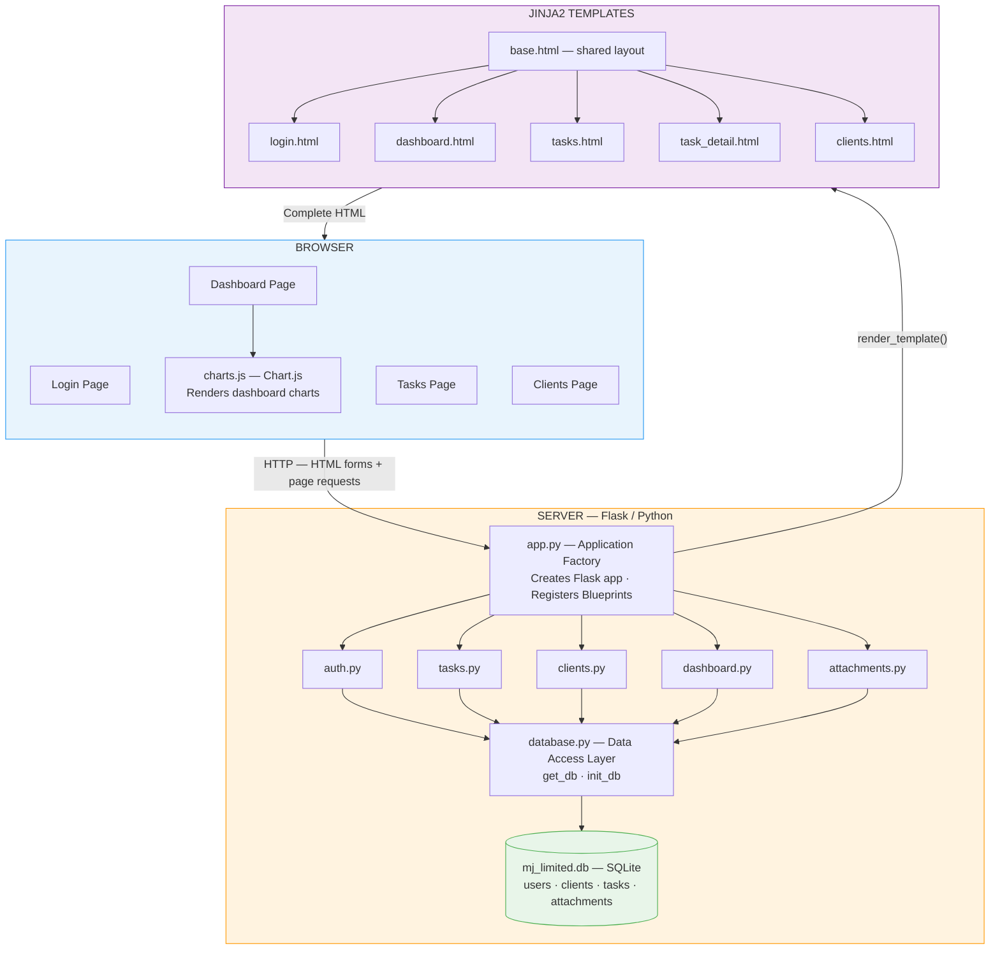
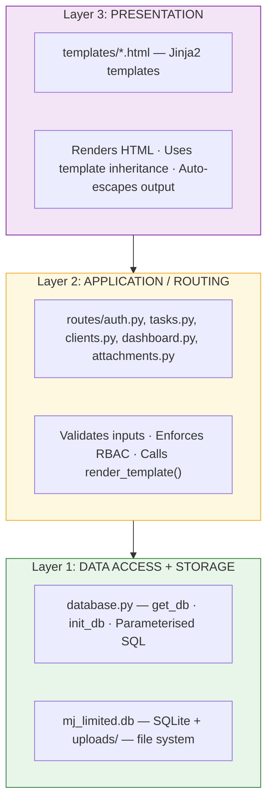
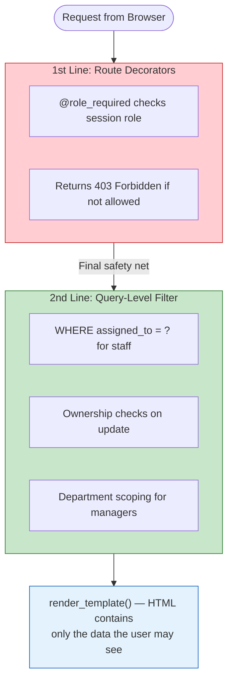
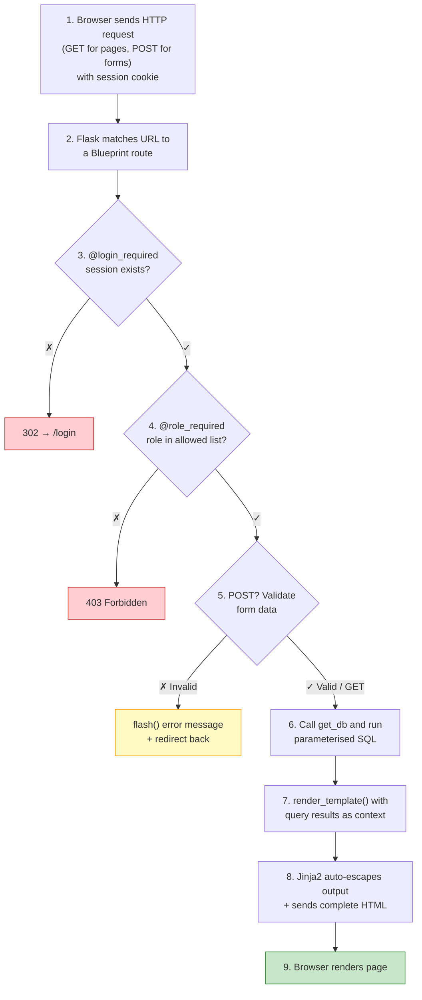

# Design Artefact 1 — System Architecture

## Overview

This document describes the high-level architecture of the MJ Limited Business Task Manager. It covers the overall system structure, the technology stack, the communication patterns between components, and the layered design that organises the codebase.

> **📋 Student Scope**
>
> **Core — what you need:** Sections 1–3. An architecture diagram showing how the browser interacts with the server, a technology stack table explaining your choices, and a layered architecture diagram showing how the code is organised. These three things prove to the examiner that you understood the system structure before you started coding.
>
> **Stretch — what makes it exceptional:** Sections 4–6 go further: the two-line RBAC enforcement diagram, the request processing flowchart, and the annotated file structure map. These add depth and show a level of architectural thinking that most professional developers would recognise. They're worth doing if you have time — each one only takes 15–20 minutes once the system is built — but they're not expected.

---

## 1. Architecture Style: Server-Rendered Monolith

The system follows a **server-rendered monolithic architecture** — Flask handles both the application logic and the HTML generation:



### Why Server-Rendered?

| Consideration | Decision |
|---|---|
| **Simplicity** | One language (Python) handles everything — no separate frontend JavaScript application to learn, build, or debug. |
| **Security** | All authorisation checks and HTML generation happen on the server. The browser receives only what the user is allowed to see (FR-AUTH-03). |
| **No build tools** | Templates are plain HTML with Jinja2 tags — no transpilation, bundling, or source maps required. |
| **Industry relevance** | Server-rendered frameworks (Django, Flask, Rails, Laravel) power the majority of business web applications. This architecture mirrors real-world practice. |

---

## 2. Technology Stack

| Layer | Technology | Version | Why |
|---|---|---|---|
| **Templates** | Jinja2 | 3.x | Flask's built-in template engine. Supports inheritance (``), auto-escaping (XSS protection by default), and clean separation of HTML from logic. |
| **CSS Framework** | Pico CSS | v2 | Classless — applies to semantic HTML with zero classes. Keeps the markup clean and accessible. |
| **Charts** | Chart.js | v4 | Declarative API, responsive by default, widely documented. The only JavaScript in the project. |
| **Backend** | Python / Flask | 3.x / 3.1 | Lightweight micro-framework. Each feature is a Blueprint, keeping the codebase modular (NFR-MAINT-01). |
| **Database** | SQLite | 3 | Zero-configuration, file-based, built into Python. Perfect for prototyping and small deployments. |
| **Password Hashing** | Werkzeug | 3.1 | Flask's own dependency. Uses scrypt with per-user salts (FR-AUTH-02). |
| **Deployment** | Flask dev server | — | Zero configuration, runs on any machine with Python 3.x. |

---

## 3. Layered Architecture

The server is organised into three logical layers. Each layer depends only on the layer below it.



### Why Three Layers (Not Four)?

In the API/SPA pattern, there are four layers because the frontend (JavaScript) and the API (Flask routes) are separate. Here, Flask routes and Jinja2 templates are tightly coupled — the route calls `render_template()` directly — so we combine them into a simpler three-layer model.

- **Maintainability (NFR-MAINT-01):** A change to the database schema only affects Layer 1 queries and Layer 2 routes — templates are unaffected as long as the variable names stay the same.
- **Testability:** Each layer can be tested independently.
- **Security:** RBAC is enforced in Layer 2 before any template is rendered.
- **Replaceability:** SQLite could be swapped for PostgreSQL by changing Layer 1 alone.

---

## 4. RBAC Enforcement Architecture (FR-AUTH-03)

Role-based access control is enforced across **two lines of defence** — a defence-in-depth strategy. These are NOT the same as the three architectural layers in Section 3; they describe *where access control checks happen*, not how the code is organised.



| Line of Defence | Role | What It Does | Bypassable? |
|---|---|---|---|
| **1st — Route Decorators** | Primary security boundary | `@role_required` checks session role before any route logic runs; returns 403 if not permitted | ❌ No — server-side check |
| **2nd — Query-Level Filter** | Safety net | SQL `WHERE` clauses scope data to the user's own records (staff) or department (managers); ownership checks on update | ❌ No — data never leaves the database |

### Why Not Three Lines?

In a server-rendered architecture, there is no separate frontend to "hide" UI elements as a first defence. Instead, the Jinja2 template simply **never renders** the restricted markup in the first place — `` blocks are evaluated server-side before the HTML reaches the browser. This is a design property of the architecture, not a defence line — it cannot be bypassed because the restricted HTML is never sent.

---

## 5. Request Processing Flow

Every page request follows this consistent processing pipeline:



### POST Requests: The PRG Pattern

For form submissions (creating tasks, updating clients, etc.), the server follows the **Post-Redirect-Get (PRG)** pattern:

1. **POST** — Browser submits the form data
2. **Process** — Server validates, runs the database query
3. **Redirect** — Server responds with `302 → /tasks` (not a rendered page)
4. **GET** — Browser follows the redirect and requests the page fresh

This prevents the "resubmit form?" warning when users refresh the page after a submission.

---

## 6. File Structure Map

The layer labels below refer to the **Layered Architecture** in Section 3: Presentation (top) → Application/Routing → Data Access + Storage (bottom).

```
group-project-jinja/
├── app.py                      # Application factory — registers Blueprints
├── database.py                 # Data Access layer — get_db, init_db
├── seed_data.py                # Initial data population
├── .env                        # Environment variables (SECRET_KEY)
├── requirements.txt            # Python dependencies
├── routes/                     # Application layer — Blueprint routes
│   ├── auth.py                 # /login, /logout
│   ├── tasks.py                # /tasks CRUD (GET, POST)
│   ├── clients.py              # /clients CRUD (GET, POST)
│   ├── dashboard.py            # /dashboard (role-filtered)
│   └── attachments.py          # /attachments/upload, /download, /delete
├── templates/                  # Presentation layer — Jinja2 templates
│   ├── base.html               # Shared layout (nav, flash messages, scripts)
│   ├── login.html              # Login form
│   ├── dashboard.html          # Dashboard (role-filtered cards + charts)
│   ├── tasks.html              # Task list + create/edit forms
│   ├── task_detail.html         # Single task view + attachments
│   └── clients.html            # Client list + create/edit forms
├── static/                     # Static assets
│   ├── js/
│   │   └── charts.js           # Chart.js — dashboard visualisation only
│   └── css/
│       └── style.css           # Custom styles over Pico CSS
├── uploads/                    # Storage layer — file attachments
├── docs/                       # Documentation portfolio
│   └── model-answer/           # Student model answer documents
└── _reference/                 # Teacher's answer key (gitignored)
```

---

> **📝 Examiner Note:** This architecture document demonstrates understanding of how components interact, why design decisions were made, and how security is structured. The Mermaid diagrams render automatically on GitHub — no external tools required. Notice the simpler three-layer architecture: because Flask generates the HTML directly via Jinja2 templates, there is no need for a separate API layer or frontend JavaScript application. This makes the codebase smaller and easier to reason about — but achieves the same security guarantees through route decorators and query-level filters.
