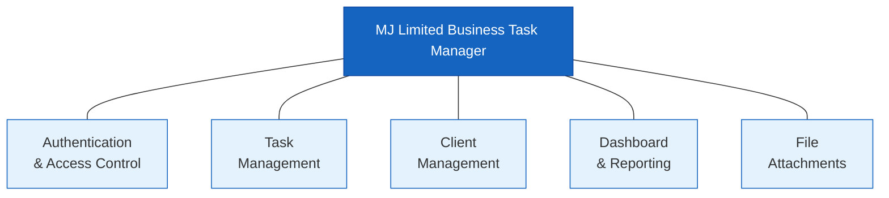

# Design Artefact 2 — Functional Decomposition Diagram

## Overview

A decomposition diagram breaks the system down into progressively smaller functional units. It shows the examiner that the developer understood the full scope of the system before writing any code, and that every feature traces back to a requirement.

> **📋 Student Scope**
>
> **Core — what you need:** The decomposition tree (Section 2) with `[FR-ID]` references on each leaf node. This is the heart of the artefact — it proves you planned every feature before coding and that each feature traces back to a requirement.
>
> **Stretch — what makes it exceptional:** The code mapping table (Section 3) and cross-cutting concerns table (Section 4) connect the design to the implementation. They take 10 minutes each once the tree is done, and they give the examiner confidence that your design actually matches your code — not just that it exists on paper.

---

## 1. Top-Level Decomposition



---

## 2. Full Decomposition Tree

```
MJ Limited Business Task Manager
│
├── 1. Authentication & Access Control
│   ├── 1.1 User Login
│   │   ├── 1.1.1 Validate credentials against database       [FR-AUTH-01]
│   │   ├── 1.1.2 Verify password hash (scrypt + salt)        [FR-AUTH-02]
│   │   └── 1.1.3 Create session with user ID, role, name     [FR-AUTH-04]
│   │
│   ├── 1.2 User Logout
│   │   └── 1.2.1 Clear session and redirect to login         [FR-AUTH-04]
│   │
│   ├── 1.3 Session Management
│   │   └── 1.3.1 Check session exists on every request       [FR-AUTH-04]
│   │
│   ├── 1.4 Role-Based Access Control
│   │   ├── 1.4.1 Enforce role at route layer (@role_required) [FR-AUTH-03]
│   │   ├── 1.4.2 Filter data by role at query layer          [FR-AUTH-03]
│   │   └── 1.4.3 Conditionally render UI via Jinja2 blocks   [FR-AUTH-03]
│   │
│   └── 1.5 User Listing
│       ├── 1.5.1 Return all users (admin, manager)           [FR-AUTH-05]
│       └── 1.5.2 Return only self (staff)                    [FR-AUTH-05]
│
├── 2. Task Management
│   ├── 2.1 Create Task
│   │   ├── 2.1.1 Validate required fields (title, status...) [FR-TASK-01]
│   │   ├── 2.1.2 Check role is admin or manager              [FR-TASK-01]
│   │   └── 2.1.3 Insert task record with all fields          [FR-TASK-01]
│   │
│   ├── 2.2 Read Tasks
│   │   ├── 2.2.1 Fetch all tasks (admin, manager)            [FR-TASK-02]
│   │   ├── 2.2.2 Fetch only assigned tasks (staff)           [FR-TASK-02]
│   │   ├── 2.2.3 Search by title or description              [FR-TASK-06]
│   │   └── 2.2.4 Filter by status, priority, department      [FR-TASK-07]
│   │
│   ├── 2.3 Update Task
│   │   ├── 2.3.1 Update any field (admin, manager)           [FR-TASK-03]
│   │   ├── 2.3.2 Update status only + own tasks (staff)      [FR-TASK-04]
│   │   └── 2.3.3 Validate field changes match role           [FR-TASK-04]
│   │
│   └── 2.4 Delete Task
│       ├── 2.4.1 Check role is admin or manager              [FR-TASK-05]
│       └── 2.4.2 Delete task and cascade attachments         [FR-TASK-05]
│
├── 3. Client Management
│   ├── 3.1 Create Client
│   │   ├── 3.1.1 Validate required fields (company, contact) [FR-CLIENT-01]
│   │   └── 3.1.2 Check role is admin or manager              [FR-CLIENT-01]
│   │
│   ├── 3.2 Read Clients
│   │   └── 3.2.1 Fetch all client records                    [FR-CLIENT-01]
│   │
│   ├── 3.3 Update Client
│   │   ├── 3.3.1 Validate fields                             [FR-CLIENT-02]
│   │   └── 3.3.2 Check role is admin or manager              [FR-CLIENT-02]
│   │
│   └── 3.4 Delete Client
│       ├── 3.4.1 Check role is admin only                    [FR-CLIENT-03]
│       └── 3.4.2 Check no linked tasks exist (flash error + redirect if linked) [FR-CLIENT-04]
│
├── 4. Dashboard & Reporting
│   ├── 4.1 Summary Statistics
│   │   ├── 4.1.1 Calculate org-wide stats (admin)            [FR-DASH-01]
│   │   ├── 4.1.2 Calculate department stats (manager)        [FR-DASH-01]
│   │   └── 4.1.3 Calculate personal stats (staff)            [FR-DASH-01]
│   │
│   └── 4.2 Chart Data
│       ├── 4.2.1 Tasks by status (all roles)                 [FR-DASH-02]
│       ├── 4.2.2 Tasks by priority (all roles)               [FR-DASH-02]
│       ├── 4.2.3 Tasks by department (admin only)            [FR-DASH-02]
│       └── 4.2.4 Workload per staff member (admin, manager)  [FR-DASH-02]
│
└── 5. File Attachments
    ├── 5.1 Upload Attachment
    │   ├── 5.1.1 Validate file type against allowlist        [FR-ATT-02]
    │   ├── 5.1.2 Validate file size (≤ 5 MB)                 [FR-ATT-02]
    │   └── 5.1.3 Rename with UUID and save to uploads/       [FR-ATT-01]
    │
    ├── 5.2 List Attachments
    │   └── 5.2.1 Fetch attachment metadata for a task        [FR-ATT-01]
    │
    ├── 5.3 Download Attachment
    │   └── 5.3.1 Serve file from uploads/ directory          [FR-ATT-03]
    │
    └── 5.4 Delete Attachment
        ├── 5.4.1 Check user is uploader, admin, or manager   [FR-ATT-03]
        └── 5.4.2 Remove file and database record             [FR-ATT-03]
```

---

## 3. Decomposition to Code Mapping

Each top-level subsystem maps directly to a Flask Blueprint module:

| Subsystem | Blueprint File | URL Prefix |
|---|---|---|
| 1. Authentication & Access Control | `routes/auth.py` | `/` (root) |
| 2. Task Management | `routes/tasks.py` | `/tasks` |
| 3. Client Management | `routes/clients.py` | `/clients` |
| 4. Dashboard & Reporting | `routes/dashboard.py` | `/dashboard` |
| 5. File Attachments | `routes/attachments.py` | `/attachments` |

Each Blueprint handles both the form processing and the HTML rendering (via `render_template()`). There is no separate API layer — the route is the controller and the view in one.

---

## 4. Cross-Cutting Concerns

Some functions are shared across multiple subsystems. These are implemented as shared utilities rather than duplicated in each Blueprint.

| Concern | Implementation | Used By |
|---|---|---|
| Session check | `@login_required` decorator in `auth.py` | All Blueprints |
| Role enforcement | `@role_required()` decorator in `auth.py` | tasks, clients |
| Database connection | `get_db()` in `database.py` | All Blueprints |
| Auto-escaping | Jinja2 auto-escape (enabled by default) | All templates |
| Template inheritance | `` | All templates |
| Flash messages | `flash()` + `get_flashed_messages()` | All Blueprints + `base.html` |

---

> **📝 Examiner Note:** A decomposition diagram shows that the developer planned the system structure BEFORE coding. The FR-ID references in square brackets demonstrate traceability from design back to requirements — a key assessment criterion. Every leaf node in this tree can be pointed to in the codebase ("this function implements node 2.3.2"). Students who skip this artefact lose marks because they cannot show they planned the structure rather than coding ad-hoc.
