# Design Artefact 3 — Data Flow Diagrams

## Overview

Data Flow Diagrams (DFDs) show how data moves through the system — who provides it, which processes transform it, and where it is stored. They are drawn at multiple levels of detail: a Level 0 (context diagram) shows the whole system as a single process, and Level 1 breaks that into sub-processes.

> **📋 Student Scope**
>
> **Core — what you need:** Sections 1–2. A Level 0 context diagram showing the system boundary and its external entities, and a Level 1 diagram breaking the system into sub-processes. These are standard DFD deliverables that the specification expects.
>
> **Stretch — what makes it exceptional:** The process description tables (Section 3), data store descriptions (Section 4), and the RBAC filter table (Section 5). The RBAC filter table is particularly powerful — it shows the examiner that data flows vary by role, which is a sophisticated concept most students miss. If you have a role-based system, this one table can significantly strengthen your design marks.

---

## 1. Level 0 — Context Diagram

The context diagram shows the system as a single process with its external entities (users by role).

### External Entities

| Entity | Role | Data Provided | Data Received |
|---|---|---|---|
| Admin User | System administrator | Login credentials, CRUD operations on all records | Organisation-wide statistics, all task/client data, 4 chart datasets |
| Manager User | Department head | Login credentials, task creation/assignment, client management | Department-scoped statistics, department tasks/clients, 3 chart datasets |
| Staff User | Regular employee | Login credentials, task status updates, file uploads | Own assigned tasks only, personal statistics, 2 chart datasets |

---

## 2. Level 1 — Process Diagram

Level 1 decomposes the single "system" process from Level 0 into its component processes.

```mermaid
flowchart TD
    EXT["External Entities<br/>Admin / Manager / Staff"]

    EXT --> P1 & P2 & P3 & P5

    P1["P1: Authentication<br/>Verify credentials · Create session<br/>Check role · End session"]
    P2["P2: Manage Tasks<br/>Create · Read · Update<br/>Delete · Search · Filter"]
    P3["P3: Manage Clients<br/>Create · Read · Update<br/>Delete · Conflict check"]
    P4["P4: Generate Dashboard<br/>Summary stats · Chart data<br/>Role-filter aggregation"]
    P5["P5: Manage Files<br/>Upload · Download · Delete"]

    P1 --> D1
    P2 --> D1 & D2 & D3
    P3 --> D3 & D2
    P4 --> D2 & D3
    P5 --> D4

    D2 --> P4

    D1[("D1: users")]
    D2[("D2: tasks")]
    D3[("D3: clients")]
    D4[("D4: attachments")]

    style EXT fill:#e8eaf6,stroke:#283593
    style P1 fill:#fff3e0,stroke:#E65100
    style P2 fill:#fff3e0,stroke:#E65100
    style P3 fill:#fff3e0,stroke:#E65100
    style P4 fill:#fff3e0,stroke:#E65100
    style P5 fill:#fff3e0,stroke:#E65100
    style D1 fill:#e8f5e9,stroke:#2E7D32
    style D2 fill:#e8f5e9,stroke:#2E7D32
    style D3 fill:#e8f5e9,stroke:#2E7D32
    style D4 fill:#e8f5e9,stroke:#2E7D32
```

---

## 3. Process Descriptions

### P1: Authentication (FR-AUTH-01 to FR-AUTH-05)

| Data Flow | Direction | Description |
|---|---|---|
| Login credentials | User → P1 | Username and password submitted via login form |
| Session cookie | P1 → User | Signed session containing user_id, role, full_name, department |
| User record | D1 → P1 | Stored username + password hash for verification |
| Logout request | User → P1 | Clears session data |
| User list | P1 → User | All users (admin/manager) or self only (staff) from D1 |

### P2: Manage Tasks (FR-TASK-01 to FR-TASK-07)

| Data Flow | Direction | Description |
|---|---|---|
| Task data | User → P2 | Title, description, status, priority, department, assigned_to, client_id, due_date |
| Task list | P2 → User | All tasks (admin/manager) or assigned-only (staff) from D2 |
| Search query | User → P2 | Text string searched against title and description |
| Filter params | User → P2 | Status, priority, department values to filter results |
| Task record | D2 ↔ P2 | CRUD operations on the tasks table |
| Client lookup | D3 → P2 | Client names for the task creation dropdown |
| User lookup | D1 → P2 | User names for the assignment dropdown |
| Status-only update | Staff User → P2 | Staff can change status field only on their own tasks |

### P3: Manage Clients (FR-CLIENT-01 to FR-CLIENT-05)

| Data Flow | Direction | Description |
|---|---|---|
| Client data | User → P3 | Company name, contact person, email, phone, industry, status, notes |
| Client list | P3 → User | All client records from D3 |
| Linked task check | D2 → P3 | Query to check if any tasks reference a client before deletion |
| Conflict error | P3 → User | Flash error + redirect if client has linked tasks |

### P4: Generate Dashboard (FR-DASH-01 to FR-DASH-03)

| Data Flow | Direction | Description |
|---|---|---|
| Summary request | User → P4 | Role determines scope: org-wide / department / personal |
| Summary stats | P4 → User | Counts: total tasks, active, overdue, clients |
| Chart datasets | P4 → User | Aggregated data: by status, by priority, by department, by assignee |
| Task data | D2 → P4 | Raw task records for aggregation via SQL GROUP BY |
| Client data | D3 → P4 | Client count (admin only) |

### P5: Manage Files (FR-ATT-01 to FR-ATT-03)

| Data Flow | Direction | Description |
|---|---|---|
| File upload | User → P5 | Binary file + original filename |
| File metadata | P5 → D4 | UUID-renamed filename, original name, uploader, date |
| Attachment list | D4 → User | List of attachments for a given task |
| File download | File System → User | Binary file served from uploads/ directory |
| Delete request | User → P5 | Only uploader, admin, or manager can delete |

---

## 4. Data Store Descriptions

| Store | Table | Key Fields | Related Processes |
|---|---|---|---|
| D1: users | `users` | id, username, password_hash, full_name, role, department | P1 (auth), P2 (assignment lookups) |
| D2: tasks | `tasks` | id, title, description, status, priority, department, assigned_to, client_id, due_date | P2 (CRUD), P4 (aggregation) |
| D3: clients | `clients` | id, company_name, contact_name, contact_email, contact_phone, industry, status, notes | P3 (CRUD), P2 (task linking), P4 (counts) |
| D4: attachments | `attachments` | id, task_id, filename, original_filename, file_size, uploaded_by, uploaded_at | P5 (file ops) |

---

## 5. RBAC Data Flow Filter

A critical detail: the data flows in the Level 1 diagram are filtered by role. The same process (e.g., P2: Manage Tasks) returns different data depending on WHO is calling.

| Process | Admin | Manager | Staff |
|---|---|---|---|
| P2: Read Tasks | All tasks | All tasks | Own tasks only (`WHERE assigned_to = ?`) |
| P2: Create Task | ✅ Allowed | ✅ Allowed | ❌ 403 Forbidden |
| P2: Update Task | All fields, any task | All fields, any task | Status only, own tasks |
| P2: Delete Task | ✅ Allowed | ✅ Allowed | ❌ 403 Forbidden |
| P3: All Operations | ✅ Full access | ✅ Except delete | ❌ 403 on all |
| P3: Delete Client | ✅ Admin only | ❌ 403 Forbidden | ❌ 403 Forbidden |
| P4: Summary Stats | Organisation-wide | Department-scoped | Personal only |
| P4: Chart Data | 4 charts | 3 charts | 2 charts |

> This RBAC filter is the reason a simple DFD is not sufficient — the data flows vary by user role, which is why the sequence diagrams (Artefact 6) show specific role-based interaction paths.

---

> **📝 Examiner Note:** DFDs demonstrate understanding of data flows through the system. The Level 0 context diagram shows the system boundary — what is inside the system and what is external. The Level 1 diagram breaks this into sub-processes that map to code modules (Blueprints). The RBAC filter table is critical — it shows the candidate understands that the same route behaves differently depending on the user's role, which is a sophisticated data flow concept. The Mermaid diagrams render automatically on GitHub. For the exam, students could use standard DFD notation (Yourdon–DeMarco or Gane–Sarson symbols) in tools like Lucidchart or Figma.
