# Design Artefact 4 — Entity-Relationship Diagram & Data Dictionary

## Overview

The Entity-Relationship Diagram (ERD) shows the database tables, their attributes, and the relationships between them. The Data Dictionary provides detailed specifications for every column — type, constraints, and purpose.

> **📋 Student Scope**
>
> **Core — what you need:** The ERD diagram with relationships (Section 1) and data dictionary entries for at least your primary keys, foreign keys, and any columns with interesting constraints or design decisions. This proves you planned your database schema before writing SQL.
>
> **Stretch — what makes it exceptional:** A complete data dictionary documenting EVERY column with its type, constraints, default, and purpose (Section 2), a validation rules summary (Section 3), and the actual SQL schema (Section 4). The full data dictionary is thorough but repetitive — if you're short on time, cover the columns where you made a real design choice (e.g., "why is phone TEXT not INTEGER?", "why is filename a UUID?"). Those are the entries that earn marks.

---

## 1. Entity-Relationship Diagram

```mermaid
erDiagram
    USERS {
        INTEGER id PK
        TEXT username "UNIQUE"
        TEXT password_hash "scrypt hash"
        TEXT full_name
        TEXT email
        TEXT role "admin | manager | staff"
        TEXT department
        TIMESTAMP created_at
    }

    CLIENTS {
        INTEGER id PK
        TEXT company_name
        TEXT contact_name
        TEXT contact_email
        TEXT contact_phone
        TEXT industry
        TEXT status "active | inactive"
        TEXT notes
        TIMESTAMP created_at
        TIMESTAMP updated_at
    }

    TASKS {
        INTEGER id PK
        TEXT title
        TEXT description
        TEXT status "open | in_progress | completed | cancelled"
        TEXT priority "low | medium | high | urgent"
        TEXT department
        INTEGER assigned_to FK "→ USERS.id"
        INTEGER client_id FK "→ CLIENTS.id"
        INTEGER created_by FK "→ USERS.id"
        TEXT due_date
        TIMESTAMP created_at
        TIMESTAMP updated_at
    }

    ATTACHMENTS {
        INTEGER id PK
        INTEGER task_id FK "→ TASKS.id ON DELETE CASCADE"
        TEXT filename "UUID-renamed on disk"
        TEXT original_filename "user's original filename"
        INTEGER file_size "bytes"
        INTEGER uploaded_by FK "→ USERS.id"
        TIMESTAMP uploaded_at
    }

    USERS ||--o{ TASKS : "assigned_to — a user can be assigned many tasks"
    CLIENTS ||--o{ TASKS : "client_id — a client can be linked to many tasks"
    TASKS ||--o{ ATTACHMENTS : "task_id — a task can have many attachments"
    USERS ||--o{ ATTACHMENTS : "uploaded_by — a user can upload many files"
```



### Relationship Summary

| Relationship | Type | Description |
|---|---|---|
| USERS → TASKS | One-to-Many | One user can be assigned many tasks. Each task has at most one assignee. |
| CLIENTS → TASKS | One-to-Many | One client can be linked to many tasks. Each task links to at most one client. A task's client_id can be NULL (no client). |
| TASKS → ATTACHMENTS | One-to-Many | One task can have many file attachments. Each attachment belongs to exactly one task. |
| USERS → ATTACHMENTS | One-to-Many | One user can upload many attachments. `uploaded_by` tracks who uploaded each file. |

### Cardinality Notation (Crow's Foot)

This ERD uses **crow's foot notation**, which is the convention used by Mermaid and most modern database design tools.

| Symbol | Name | Meaning | Example in this ERD |
|---|---|---|---|
| `\|\|` | One (mandatory) | Exactly one, required | One user… |
| `o{` | Many (optional) | Zero or more | …can be assigned zero or many tasks |
| `PK` | Primary key | Uniquely identifies each row | `id` in every table |
| `FK` | Foreign key | References a row in another table | `assigned_to → USERS.id` |

---

## 2. Data Dictionary

### 2.1 USERS Table

Stores all system users. Role determines access level throughout the application (FR-AUTH-03).

| Column | Data Type | Constraints | Default | Description |
|---|---|---|---|---|
| `id` | INTEGER | PRIMARY KEY, AUTOINCREMENT | Auto | Unique user identifier |
| `username` | TEXT | NOT NULL, UNIQUE | — | Login identifier. Must be unique across all users. |
| `password_hash` | TEXT | NOT NULL | — | Werkzeug scrypt-hashed password with per-user salt. Never stored in plain text (FR-AUTH-02). Format: `scrypt:32768:8:1$salt$hash` |
| `full_name` | TEXT | NOT NULL | — | Display name shown in the UI (e.g., "John Smith") |
| `email` | TEXT | NOT NULL | — | User's email address (e.g., "j.smith@mjlimited.co.uk") |
| `role` | TEXT | NOT NULL | — | One of: `admin`, `manager`, `staff`. Determines all access permissions. Enforced by CHECK constraint in the database AND validated in the application. |
| `department` | TEXT | NOT NULL | — | One of the MJ Limited departments: Management & Strategy, Client Services, Finance, Administration, HR |
| `created_at` | TIMESTAMP | NOT NULL | `CURRENT_TIMESTAMP` | Account creation timestamp. Set automatically by the database. |

**Indexes:** Unique index on `username` (enforced by UNIQUE constraint).

**Seed data:** 8 users — 1 admin, 3 managers, 4 staff across departments.

### 2.2 CLIENTS Table

Stores business client records managed by MJ Limited (FR-CLIENT-01).

| Column | Data Type | Constraints | Default | Description |
|---|---|---|---|---|
| `id` | INTEGER | PRIMARY KEY, AUTOINCREMENT | Auto | Unique client identifier |
| `company_name` | TEXT | NOT NULL | — | Name of the client organisation (e.g., "Acme Corp") |
| `contact_name` | TEXT | NOT NULL | — | Primary contact's name at the client organisation |
| `contact_email` | TEXT | NOT NULL | — | Contact email address. Not validated for format at database level. |
| `contact_phone` | TEXT | — | NULL | Contact phone number. Stored as text to preserve formatting (e.g., "+44 121 ..."). |
| `industry` | TEXT | — | NULL | Industry sector (e.g., "Technology", "Healthcare"). Free text. |
| `status` | TEXT | NOT NULL | `'active'` | One of: `active`, `inactive`. Determined by CHECK constraint. Determines whether client appears in active listings. |
| `notes` | TEXT | — | NULL | Free-text notes about the client. Can be lengthy. |
| `created_at` | TIMESTAMP | NOT NULL | `CURRENT_TIMESTAMP` | Record creation timestamp. |
| `updated_at` | TIMESTAMP | NOT NULL | `CURRENT_TIMESTAMP` | Last modification timestamp. |

**Deletion constraint:** Cannot delete a client if any tasks reference it (FR-CLIENT-04). The application checks `SELECT COUNT(*) FROM tasks WHERE client_id = ?` before deletion and shows a flash error and redirects if count > 0.

**Seed data:** 5 clients across different industries.

### 2.3 TASKS Table

Core entity storing work items assigned to staff members (FR-TASK-01).

| Column | Data Type | Constraints | Default | Description |
|---|---|---|---|---|
| `id` | INTEGER | PRIMARY KEY, AUTOINCREMENT | Auto | Unique task identifier |
| `title` | TEXT | NOT NULL | — | Short descriptive title (e.g., "Update client database") |
| `description` | TEXT | — | NULL | Detailed description of the work required |
| `status` | TEXT | NOT NULL | `'open'` | One of: `open`, `in_progress`, `completed`, `cancelled`. Enforced by CHECK constraint. Staff can only update THIS field on their own tasks (FR-TASK-04). |
| `priority` | TEXT | NOT NULL | `'medium'` | One of: `low`, `medium`, `high`, `urgent`. Enforced by CHECK constraint. Used for filtering and dashboard charts. |
| `department` | TEXT | NOT NULL | — | The department this task belongs to. Used for manager scoping and dashboard charts. |
| `assigned_to` | INTEGER | FOREIGN KEY → USERS(id) | NULL | The user assigned to this task. Used for staff data filtering — staff only see tasks WHERE assigned_to = their user ID (FR-TASK-02). |
| `client_id` | INTEGER | FOREIGN KEY → CLIENTS(id) | NULL | The client this task relates to. Optional — some tasks are internal. NULL means no client link. |
| `due_date` | TEXT | — | NULL | ISO 8601 date string (YYYY-MM-DD). Used for "overdue" calculations on the dashboard. |
| `created_by` | INTEGER | NOT NULL, FOREIGN KEY → USERS(id) | — | The user who created this task. Tracks accountability. |
| `created_at` | TIMESTAMP | NOT NULL | `CURRENT_TIMESTAMP` | Task creation timestamp. |
| `updated_at` | TIMESTAMP | NOT NULL | `CURRENT_TIMESTAMP` | Last modification timestamp. |

**Foreign key constraints:** `assigned_to REFERENCES users(id)`, `client_id REFERENCES clients(id)`, `created_by REFERENCES users(id)`. Enforced by `PRAGMA foreign_keys = ON` in database.py.

**RBAC impact on queries:**
- Admin: `SELECT * FROM tasks` (no filter)
- Manager: `SELECT * FROM tasks WHERE department = ?` (own department only)
- Staff: `SELECT * FROM tasks WHERE assigned_to = ?` (own tasks only)

**Seed data:** 10 tasks across departments with varied statuses and priorities.

### 2.4 ATTACHMENTS Table

Stores metadata for files uploaded against tasks (FR-ATT-01).

| Column | Data Type | Constraints | Default | Description |
|---|---|---|---|---|
| `id` | INTEGER | PRIMARY KEY, AUTOINCREMENT | Auto | Unique attachment identifier |
| `task_id` | INTEGER | NOT NULL, FOREIGN KEY → TASKS(id) ON DELETE CASCADE | — | The task this file is attached to. On task deletion, associated attachments are automatically deleted by the database cascade rule. |
| `filename` | TEXT | NOT NULL | — | UUID-renamed filename stored on disk (e.g., `a1b2c3d4e5f6...pdf`). Prevents path traversal attacks and filename collisions (NFR-SEC-05). |
| `original_filename` | TEXT | NOT NULL | — | The user's original filename (e.g., `Q3 Report.pdf`). Displayed in the UI but never used for file system operations. |
| `file_size` | INTEGER | NOT NULL | — | File size in bytes. Used for display and validation. |
| `uploaded_by` | INTEGER | NOT NULL, FOREIGN KEY → USERS(id) | — | User who uploaded the file. Used for deletion permission checks — only the uploader, admin, or manager can delete (FR-ATT-03). |
| `uploaded_at` | TIMESTAMP | NOT NULL | `CURRENT_TIMESTAMP` | Upload timestamp. |

**File system:** The physical files are stored in the `uploads/` directory, named by the `filename` column (UUID). The `original_filename` column is used only for display.

**Allowed file types (NFR-SEC-04):**
`pdf, doc, docx, xls, xlsx, csv, txt, png, jpg, jpeg, gif`

**Maximum file size:** 5 MB (enforced by Flask's `MAX_CONTENT_LENGTH`).

---

## 3. Validation Rules Summary

| Table | Field | Validation | Where Enforced |
|---|---|---|---|
| users | username | Unique, not empty | DB UNIQUE + app check |
| users | password_hash | Not empty, hashed before storage | Application |
| users | role | Must be admin, manager, or staff | DB CHECK + Application |
| tasks | title | Not empty | Application (400 error) |
| tasks | status | Must be valid enum value | DB CHECK + Application |
| tasks | priority | Must be valid enum value | DB CHECK + Application |
| tasks | assigned_to | Must reference existing user | FK constraint |
| tasks | client_id | Must reference existing client or NULL | FK constraint |
| clients | company_name | Not empty | Application (400 error) |
| attachments | file type | Must be in allowed extensions list | Application |
| attachments | file size | ≤ 5 MB | Flask config |
| attachments | filename | UUID-renamed, original preserved | Application |

---

## 4. SQL Schema (as implemented in database.py)

```sql
CREATE TABLE IF NOT EXISTS users (
    id INTEGER PRIMARY KEY AUTOINCREMENT,
    username TEXT NOT NULL UNIQUE,
    password_hash TEXT NOT NULL,
    full_name TEXT NOT NULL,
    email TEXT NOT NULL,
    role TEXT NOT NULL CHECK(role IN ('admin', 'manager', 'staff')),
    department TEXT NOT NULL,
    created_at TIMESTAMP DEFAULT CURRENT_TIMESTAMP
);

CREATE TABLE IF NOT EXISTS clients (
    id INTEGER PRIMARY KEY AUTOINCREMENT,
    company_name TEXT NOT NULL,
    contact_name TEXT NOT NULL,
    contact_email TEXT NOT NULL,
    contact_phone TEXT,
    industry TEXT,
    status TEXT NOT NULL DEFAULT 'active' CHECK(status IN ('active', 'inactive')),
    notes TEXT,
    created_at TIMESTAMP DEFAULT CURRENT_TIMESTAMP,
    updated_at TIMESTAMP DEFAULT CURRENT_TIMESTAMP
);

CREATE TABLE IF NOT EXISTS tasks (
    id INTEGER PRIMARY KEY AUTOINCREMENT,
    title TEXT NOT NULL,
    description TEXT,
    status TEXT NOT NULL DEFAULT 'open' CHECK(status IN ('open', 'in_progress', 'completed', 'cancelled')),
    priority TEXT NOT NULL DEFAULT 'medium' CHECK(priority IN ('low', 'medium', 'high', 'urgent')),
    department TEXT NOT NULL,
    assigned_to INTEGER,
    client_id INTEGER,
    due_date TEXT,
    created_by INTEGER NOT NULL,
    created_at TIMESTAMP DEFAULT CURRENT_TIMESTAMP,
    updated_at TIMESTAMP DEFAULT CURRENT_TIMESTAMP,
    FOREIGN KEY (assigned_to) REFERENCES users(id),
    FOREIGN KEY (client_id) REFERENCES clients(id),
    FOREIGN KEY (created_by) REFERENCES users(id)
);

CREATE TABLE IF NOT EXISTS attachments (
    id INTEGER PRIMARY KEY AUTOINCREMENT,
    task_id INTEGER NOT NULL,
    filename TEXT NOT NULL,
    original_filename TEXT NOT NULL,
    file_size INTEGER NOT NULL,
    uploaded_by INTEGER NOT NULL,
    uploaded_at TIMESTAMP DEFAULT CURRENT_TIMESTAMP,
    FOREIGN KEY (task_id) REFERENCES tasks(id) ON DELETE CASCADE,
    FOREIGN KEY (uploaded_by) REFERENCES users(id)
);
```

---

> **📝 Examiner Note:** The ERD and data dictionary together demonstrate database design competence. The ERD shows relationships visually; the data dictionary provides the detail examiners look for — data types, constraints, defaults, and the reasoning behind design choices (e.g., why `phone` is TEXT not INTEGER, why `filename` is UUID-based). The SQL schema proves this design was actually implemented. Students should note the RBAC impact on queries — the same table is queried differently depending on the user's role, which shows understanding of how access control intersects with data design. The FK constraints and PRAGMA foreign_keys enforcement show awareness of referential integrity.
