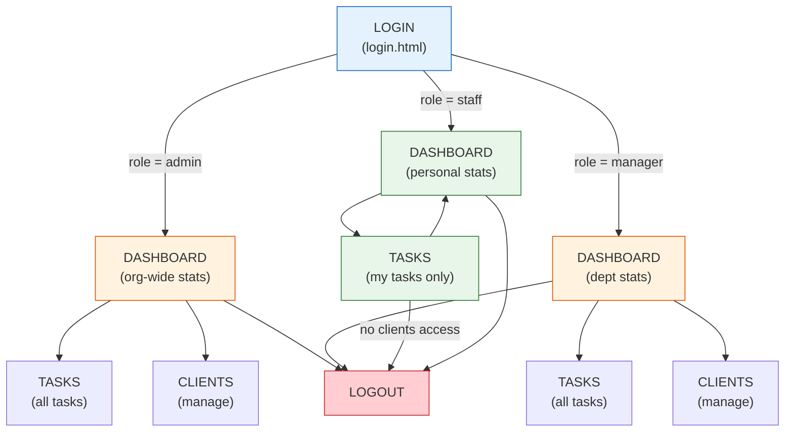

# Design Artefact 5 — Wireframes & Screen Flow

## Overview

Wireframes show the planned layout of each page. Screen flow diagrams show how users navigate between pages. Because this system uses RBAC, the wireframes must show how the SAME page appears differently for different roles — this is a critical design consideration.

> **📋 Student Scope**
>
> **Core — what you need:** The screen flow diagram (Section 1) plus one wireframe per page — login, dashboard, tasks, clients. Four wireframes is a strong submission. Use Figma, Balsamiq, or even pen-and-paper photos — the tool doesn't matter, the thinking does.
>
> **Stretch — what makes it exceptional:** Drawing role-variant wireframes — showing how the SAME page looks different for admin, manager, and staff. This document shows the full stretch version: the screen flow diagram (Section 1), role-variant wireframes for every page (Sections 2.2–2.7), the task create/edit modal (Section 3), a UI component legend (Section 4), and responsive behaviour notes (Section 5). If you're short on time, a pragmatic alternative: draw one wireframe per page and annotate it with notes like "Staff: ❌ Add Task button hidden, ❌ Delete column removed, status-only edit dialog shown instead." Same insight, less drawing.

---

## 1. Screen Flow Diagram



### Navigation Rules by Role

| Navigation Element | Admin | Manager | Staff |
|---|---|---|---|
| Dashboard link | ✅ Visible | ✅ Visible | ✅ Visible |
| Tasks link | ✅ Visible | ✅ Visible | ✅ Visible |
| Clients link | ✅ Visible | ✅ Visible | ❌ Hidden |
| Post-login redirect | → Dashboard | → Dashboard | → Dashboard |
| Clients page direct URL | Full access | Full access | 403 Forbidden |

---

## 2. Page Wireframes

### 2.1 Login Page (login.html)

All roles see the same login page.

```
┌────────────────────────────────────────────────────┐
│                                                    │
│              MJ Limited                            │
│         Business Task Manager                      │
│                                                    │
│  ┌──────────────────────────────────────────────┐  │
│  │                                              │  │
│  │   Username  ┌──────────────────────────┐     │  │
│  │             │                          │     │  │
│  │             └──────────────────────────┘     │  │
│  │                                              │  │
│  │   Password  ┌──────────────────────────┐     │  │
│  │             │ ●●●●●●●●                 │     │  │
│  │             └──────────────────────────┘     │  │
│  │                                              │  │
│  │   ┌────────────────────────────────────┐     │  │
│  │   │           Sign In                  │     │  │
│  │   └────────────────────────────────────┘     │  │
│  │                                              │  │
│  │   [error message area - hidden by default]   │  │
│  │                                              │  │
│  └──────────────────────────────────────────────┘  │
│                                                    │
│   Demo accounts:                                   │
│   Admin: admin / admin123                          │
│   Manager: m.jones / manager123                    │
│   Staff: j.smith / staff123                        │
│                                                    │
└────────────────────────────────────────────────────┘
```

### 2.2 Dashboard — Admin View

```
┌────────────────────────────────────────────────────────────┐
│  ┌──────────────────────────────────────────────────────┐  │
│  │ 📊 Dashboard   📋 Tasks   👥 Clients    [Admin ●]     │  │
│  │                                           Logout     │  │
│  └──────────────────────────────────────────────────────┘  │
│                                                            │
│   Organisation Overview                                    │
│   Admin Dashboard — all departments                        │
│                                                            │
│   ┌────────┐  ┌────────┐  ┌────────┐  ┌────────┐           │
│   │ Total  │  │ Active │  │Overdue │  │Clients │           │
│   │ Tasks  │  │ Tasks  │  │ Tasks  │  │        │           │
│   │  10    │  │   6    │  │   2    │  │   5    │           │
│   └────────┘  └────────┘  └────────┘  └────────┘           │
│                                                            │
│   ┌─────────────────────┐  ┌─────────────────────┐         │
│   │ Tasks by Status     │  │ Tasks by Priority   │         │
│   │ [Doughnut Chart]    │  │ [Doughnut Chart]    │         │
│   │                     │  │                     │         │
│   └─────────────────────┘  └─────────────────────┘         │
│                                                            │
│   ┌─────────────────────┐  ┌─────────────────────┐         │
│   │ Tasks by Department │  │ Workload by Staff   │         │
│   │ [Bar Chart]         │  │ [Bar Chart]         │         │
│   │                     │  │                     │         │
│   └─────────────────────┘  └─────────────────────┘         │
│                                                            │
└────────────────────────────────────────────────────────────┘
```

### 2.3 Dashboard — Manager View

```
┌────────────────────────────────────────────────────────────┐
│  ┌──────────────────────────────────────────────────────┐  │
│  │ 📊 Dashboard   📋 Tasks   👥 Clients  [Manager ●]     │  │
│  │                                           Logout     │  │
│  └──────────────────────────────────────────────────────┘  │
│                                                            │
│   Department Overview — IT                                 │
│   Manager Dashboard                                        │
│                                                            │
│   ┌────────┐  ┌────────┐  ┌────────┐  ┌────────┐           │
│   │ Dept   │  │ Active │  │Overdue │  │Clients │           │
│   │ Tasks  │  │ Tasks  │  │ Tasks  │  │   5    │           │
│   │   4    │  │   3    │  │   1    │  │        │           │
│   └────────┘  └────────┘  └────────┘  └────────┘           │
│                                                            │
│   ┌─────────────────────┐  ┌─────────────────────┐         │
│   │ Tasks by Status     │  │ Tasks by Priority   │         │
│   │ [Doughnut Chart]    │  │ [Doughnut Chart]    │         │
│   │                     │  │                     │         │
│   └─────────────────────┘  └─────────────────────┘         │
│                                                            │
│   ┌─────────────────────┐                                  │
│   │ Workload by Staff   │  ← NO department chart           │
│   │ [Bar Chart]         │    (already dept-scoped)         │
│   │                     │                                  │
│   └─────────────────────┘                                  │
│                                                            │
└────────────────────────────────────────────────────────────┘
```

### 2.4 Dashboard — Staff View

Staff are redirected to the Dashboard on login (same as all roles). They see personal task statistics only — no client or department data.

```
┌───────────────────────────────────────────────────────────┐
│  ┌─────────────────────────────────────────────────────┐  │
│  │ 📊 Dashboard   📋 Tasks                  [Staff ●]   │  │
│  │                                           Logout    │  │
│  └─────────────────────────────────────────────────────┘  │
│                                                           │
│   My Overview                                             │
│                                                           │
│   ┌────────┐  ┌────────┐  ┌────────┐                      │
│   │ My     │  │ Open   │  │Overdue │                      │
│   │ Tasks  │  │ Tasks  │  │ Tasks  │                      │
│   │   2    │  │   1    │  │   0    │                      │
│   └────────┘  └────────┘  └────────┘                      │
│                                                           │
│   ┌─────────────────────┐  ┌─────────────────────┐        │
│   │ Tasks by Status     │  │ Tasks by Priority   │        │
│   │ [Doughnut Chart]    │  │ [Doughnut Chart]    │        │
│   │                     │  │                     │        │
│   └─────────────────────┘  └─────────────────────┘        │
│                                                           │
│   ← NO department chart, NO workload chart                │
│                                                           │
└───────────────────────────────────────────────────────────┘
```

### 2.5 Tasks Page — Admin/Manager View

```
┌────────────────────────────────────────────────────────────────────┐
│  ┌──────────────────────────────────────────────────────────────┐  │
│  │ 📊 Dashboard   📋 Tasks   👥 Clients         [Admin ●]        │  │
│  └──────────────────────────────────────────────────────────────┘  │
│                                                                    │
│   Task Management                                                  │
│                                                                    │
│   ┌────────────────────────────┐  ┌──────────┐                     │
│   │ 🔍 Search tasks...         │  │+ Add Task│  ← visible           │
│   └────────────────────────────┘  └──────────┘                     │
│                                                                    │
│   Status: [All ▼]  Priority: [All ▼]  Dept: [All ▼]                │
│                                                                    │
│   ┌────────────────────────────────────────────────────────────┐   │
│   │ Title          │ Status      │ Priority │ Dept  │ Actions  │   │
│   ├────────────────┼─────────────┼──────────┼───────┼──────────┤   │
│   │ Update client  │ In Progress │ High     │ IT    │ ✏️ 🗑️     │   │
│   │ database       │             │          │       │          │   │
│   ├────────────────┼─────────────┼──────────┼───────┼──────────┤   │
│   │ Prepare Q3     │ Open        │ Medium   │ Fin.  │ ✏️ 🗑️     │   │
│   │ report         │             │          │       │          │   │
│   ├────────────────┼─────────────┼──────────┼───────┼──────────┤   │
│   │ ...more rows   │             │          │       │          │   │
│   └────────────────┴─────────────┴──────────┴───────┴──────────┘   │
│                                                                    │
└────────────────────────────────────────────────────────────────────┘
```

### 2.6 Tasks Page — Staff View

```
┌────────────────────────────────────────────────────────────────────┐
│  ┌──────────────────────────────────────────────────────────────┐  │
│  │ 📋 Tasks                                   [Staff ●]          │  │
│  │                                              Logout          │  │
│  └──────────────────────────────────────────────────────────────┘  │
│                                                                    │
│   My Tasks                    ← "My Tasks" not "Task Management"   │
│                                                                    │
│   ┌────────────────────────────┐                                   │
│   │ 🔍 Search tasks...         │     ← NO "Add Task" button         │
│   └────────────────────────────┘                                   │
│                                                                    │
│   Status: [All ▼]  Priority: [All ▼]       ← NO department filter  │
│                                                                    │
│   ┌───────────────────────────────────────────────────────────┐    │
│   │ Title          │ Status      │ Priority │ Actions         │    │
│   ├────────────────┼─────────────┼──────────┼─────────────────┤    │
│   │ Update client  │ In Progress │ High     │ [Update Status] │    │
│   │ database       │             │          │                 │    │
│   ├────────────────┼─────────────┼──────────┼─────────────────┤    │
│   │ File invoices  │ Open        │ Medium   │ [Update Status] │    │
│   │                │             │          │                 │    │
│   └────────────────┴─────────────┴──────────┴─────────────────┘    │
│                                         ↑                          │
│                        Staff see "Update Status" button            │
│                        NOT full edit or delete icons               │
│                                                                    │
└────────────────────────────────────────────────────────────────────┘
```

**Staff Status Update Dialog:**
```
┌───────────────────────────────────┐
│  Update Task Status               │
│                                   │
│  Task: Update client database     │
│                                   │
│  New Status: [In Progress ▼]      │
│                                   │
│  ┌──────────┐  ┌────────┐         │
│  │  Update  │  │ Cancel │         │
│  └──────────┘  └────────┘         │
└───────────────────────────────────┘
```

### 2.7 Clients Page — Admin/Manager View

```
┌────────────────────────────────────────────────────────────────────┐
│  ┌──────────────────────────────────────────────────────────────┐  │
│  │ 📊 Dashboard   📋 Tasks   👥 Clients       [Manager ●]        │  │
│  └──────────────────────────────────────────────────────────────┘  │
│                                                                    │
│   Client Management                                                │
│                                                                    │
│   ┌────────────────────────────┐  ┌────────────┐                   │
│   │ 🔍 Search clients...       │  │+ Add Client│                    │
│   └────────────────────────────┘  └────────────┘                   │
│                                                                    │
│   Industry: [All ▼]  Status: [All ▼]                               │
│                                                                    │
│   ┌────────────────────────────────────────────────────────────┐   │
│   │ Company      │ Contact    │ Industry  │ Status │ Actions   │   │
│   ├──────────────┼────────────┼───────────┼────────┼───────────┤   │
│   │ Acme Corp    │ J. Smith   │ Tech      │ Active │ ✏️  🗑️*    │   │
│   ├──────────────┼────────────┼───────────┼────────┼───────────┤   │
│   │ Beta LLC     │ A. Brown   │ Finance   │ Active │ ✏️  🗑️*    │   │
│   └──────────────┴────────────┴───────────┴────────┴───────────┘   │
│                                                                    │
│   * Delete button only visible for admin role                      │
│     Manager sees edit only                                         │
│                                                                    │
└────────────────────────────────────────────────────────────────────┘
```

### 2.8 Clients Page — Staff View

```
Staff users are redirected to /tasks automatically.
If they somehow reach /clients, the route decorator checks their role
and returns 403 Forbidden. The template is never rendered for unauthorised users.
```

---

## 3. Task Create/Edit Modal (Admin/Manager only)

```
┌────────────────────────────────────────────────────────┐
│  Create New Task                    [×]                │
│                                                        │
│  Title *        ┌──────────────────────────────────┐   │
│                 │                                  │   │
│                 └──────────────────────────────────┘   │
│                                                        │
│  Description    ┌──────────────────────────────────┐   │
│                 │                                  │   │
│                 │                                  │   │
│                 └──────────────────────────────────┘   │
│                                                        │
│  Status *       [Open ▼]                               │
│  Priority *     [Medium ▼]                             │
│  Department     [-- Select -- ▼]                       │
│  Assigned To    [-- Select -- ▼]  ← populated from     │
│                                     template context (users list)         │
│  Client         [-- None -- ▼]   ← populated from      │
│                                     template context (clients list)       │
│  Due Date       ┌──────────────────────────────────┐   │
│                 │ YYYY-MM-DD                       │   │
│                 └──────────────────────────────────┘   │
│                                                        │
│  ┌──────────────────┐  ┌──────────┐                    │
│  │    Save Task     │  │  Cancel  │                    │
│  └──────────────────┘  └──────────┘                    │
│                                                        │
│  [Validation errors appear here with red border]       │
└────────────────────────────────────────────────────────┘
```

---

## 4. UI Component Legend

| Component | Implementation | Purpose |
|---|---|---|
| Navigation bar | `base.html` template | Role-conditional links via ``, user badge with role colour |
| Stat cards | CSS grid, 4 across desktop | Summary metrics, count varies by role |
| Data tables | Semantic `<table>` elements | Display records with action buttons |
| Modal dialogs | `<dialog>` element + JS | Create/edit forms without page navigation |
| Flash messages | Flask `flash()` rendered in `base.html` | Feedback after actions (success/error) |
| Filter dropdowns | `<select>` elements | Refine displayed data |
| Search input | `<input type="search">` | Text search submitted via form GET request |
| Role badges | Coloured `<span>` with CSS | Visual role identification: Admin=red, Manager=blue, Staff=green |

---

## 5. Responsive Behaviour

| Viewport | Layout Changes |
|---|---|
| Desktop (>1024px) | Stat cards in 4-column grid, charts in 2-column grid, full table columns |
| Tablet (768-1024px) | Stat cards in 2-column grid, charts stack vertically, table scrolls horizontally |
| Mobile (<768px) | All elements stack single-column, navigation collapses, modals fill screen width |

---

> **📝 Examiner Note:** Wireframes demonstrate that the UI was planned before coding, not designed ad-hoc. The critical differentiator here is showing **role variants** — the same page looks different for admin, manager, and staff. This proves the candidate considered RBAC at the design stage (not just in code). Many students draw one wireframe per page; strong candidates draw wireframes that show how permissions change the user experience. The wireframes here can be redrawn in Figma or Balsamiq for final submission.
