# Design Artefact 6 — Sequence Diagrams

## Overview

Sequence diagrams show the order of interactions between components over time for specific use cases. They are particularly valuable for showing how RBAC decisions flow through the system — the same action triggers different responses depending on the user's role.

> **📋 Student Scope**
>
> **Core — what you need:** Three well-chosen sequence diagrams: a successful login (Diagram 1), an RBAC rejection (Diagram 2), and one role-filtered data flow such as the dashboard (Diagram 5). These three cover the key runtime behaviours: authentication, authorisation failure, and data scoping by role.
>
> **Stretch — what makes it exceptional:** The additional diagrams shown below — staff allowed update (Diagram 3), client deletion conflict (Diagram 4), dashboard role-filtering (Diagram 5), file upload (Diagram 6) — add thoroughness, but they follow the same structural pattern. If you can draw three well, the examiner trusts you could draw the others. The value is in choosing the RIGHT three sequences — the ones that show your most complex decision logic — not in quantity.

---

## 1. Successful Login (FR-AUTH-01, FR-AUTH-02)

```mermaid
sequenceDiagram
    participant B as Browser
    participant F as Flask (auth.py)
    participant DB as Database (SQLite)

    B->>F: POST /login<br/>form: username + password
    F->>DB: SELECT * FROM users<br/>WHERE username = ?
    DB-->>F: user row (id, password hash,<br/>role, dept, name)
    Note right of F: check_password_hash(<br/>stored_hash, input) → True
    Note right of F: session["user_id"] = id<br/>session["role"] = role<br/>session["full_name"] = name<br/>session["department"] = dept
    F-->>B: 302 Redirect → /dashboard<br/>Set-Cookie: session=...
    B->>F: GET /dashboard
    Note right of F: @login_required → ✅<br/>render_template("dashboard.html")
    F-->>B: 200 OK — complete HTML page
```

### Failed Login

```mermaid
sequenceDiagram
    participant B as Browser
    participant F as Flask (auth.py)
    participant DB as Database (SQLite)

    B->>F: POST /login<br/>form: username + password
    F->>DB: SELECT * FROM users<br/>WHERE username = ?
    DB-->>F: user row returned
    Note right of F: check_password_hash() → False
    Note right of F: flash("Invalid username or password")
    F-->>B: 302 Redirect → /login
    B->>F: GET /login
    F-->>B: 200 OK — login page<br/>with flashed error message
```

---

## 2. Staff Attempts to Create Task — RBAC Rejection (FR-TASK-01, FR-AUTH-03)

This is the most important sequence diagram for demonstrating RBAC. It shows the two lines of defence in action.

```mermaid
sequenceDiagram
    participant B as Browser (staff user)
    participant F as Flask (tasks.py)
    participant DB as Database

    Note over B: In the server-rendered architecture,<br/>templates never include the "Add Task"<br/>form for staff users — they never see it.

    Note over B: But what if they craft<br/>a direct POST request?

    B->>F: POST /tasks/create<br/>Cookie: session=...<br/>form: title="Sneaky task"

    Note over F: DEFENCE LINE 1 — DECORATOR
    Note right of F: @login_required<br/>→ session exists? ✅
    Note right of F: @role_required("admin","manager")<br/>→ session["role"] = "staff"<br/>→ "staff" NOT in allowed list<br/>→ REJECT

    F-->>B: 403 Forbidden
    Note over DB: Database is never queried
```

---

## 3. Staff Updates Own Task Status (FR-TASK-04) — Allowed

```mermaid
sequenceDiagram
    participant B as Browser (staff user)
    participant F as Flask (tasks.py)
    participant DB as Database

    B->>F: POST /tasks/5/status<br/>Cookie: session=...<br/>form: status=in_progress

    Note right of F: @login_required → ✅

    F->>DB: SELECT assigned_to<br/>FROM tasks WHERE id=5
    DB-->>F: assigned_to = 4

    Note right of F: DEFENCE LINE 2 — QUERY FILTER<br/>Check: assigned_to == user_id?<br/>→ 4 == 4 → ✅ (own task)

    F->>DB: UPDATE tasks<br/>SET status = ?<br/>WHERE id = 5
    DB-->>F: OK (1 row updated)

    Note right of F: flash("Task status updated")
    F-->>B: 302 Redirect → /tasks
    B->>F: GET /tasks
    F-->>B: 200 OK — tasks page<br/>with success flash message
```

---

## 4. Delete Client with Linked Tasks (FR-CLIENT-03, FR-CLIENT-04)

```mermaid
sequenceDiagram
    participant B as Browser (admin user)
    participant F as Flask (clients.py)
    participant DB as Database

    B->>F: POST /clients/3/delete<br/>Cookie: session=...

    Note right of F: @login_required → ✅<br/>@role_required("admin") → ✅

    F->>DB: SELECT COUNT(*)<br/>FROM tasks<br/>WHERE client_id = 3
    DB-->>F: count = 2

    Note right of F: count > 0 → CONFLICT
    Note right of F: flash("Cannot delete client with 2 linked task(s). Reassign or delete the tasks first.")

    F-->>B: 302 Redirect → /clients
    B->>F: GET /clients
    F-->>B: 200 OK — clients page<br/>with error flash message
```

---

## 5. Dashboard Loading (FR-DASH-01, FR-DASH-02) — Role-Filtered

```mermaid
sequenceDiagram
    participant B as Browser
    participant F as Flask (dashboard.py)
    participant DB as Database

    B->>F: GET /dashboard<br/>Cookie: session=...

    Note right of F: @login_required → ✅<br/>role = session["role"]<br/>dept = session["department"]

    alt role === "admin"
        F->>DB: SELECT COUNT(*) FROM tasks<br/>(no WHERE filter — all tasks)<br/>+ client count
        F->>DB: GROUP BY queries<br/>→ 4 chart datasets
    else role === "manager"
        F->>DB: SELECT COUNT(*)<br/>WHERE department = ?<br/>(dept-scoped, + client count)
        F->>DB: GROUP BY queries<br/>→ 3 chart datasets
    else role === "staff"
        F->>DB: SELECT COUNT(*)<br/>WHERE assigned_to = ?<br/>(personal only)
        F->>DB: GROUP BY queries<br/>→ 2 chart datasets
    end

    DB-->>F: aggregated counts + chart data

    Note right of F: render_template(<br/>"dashboard.html",<br/>stats=stats,<br/>charts=chart_data)

    F-->>B: 200 OK — dashboard page<br/>with stats cards + chart data<br/>embedded as template variables

    Note left of B: Chart.js reads data from<br/>script block in HTML<br/>→ renders charts client-side
```

---

## 6. File Upload Flow (FR-ATT-01, FR-ATT-02)

```mermaid
sequenceDiagram
    participant B as Browser
    participant F as Flask (attachments.py)
    participant FS as File System + DB

    B->>F: POST /attachments/upload/5<br/>Content-Type: multipart/form-data<br/>file: report.pdf (2.1MB)

    Note right of F: @login_required → ✅
    Note right of F: Validate extension:<br/>"pdf" in ALLOWED? → ✅
    Note right of F: Validate size:<br/>2.1MB ≤ 5MB? → ✅
    Note right of F: Generate UUID filename:<br/>"a1b2c3d4e5f6...pdf"

    F->>FS: Save file to<br/>uploads/a1b2c3d4e5f6...pdf
    F->>FS: INSERT INTO<br/>attachments (...)

    Note right of F: flash("File uploaded successfully")
    F-->>B: 302 Redirect → /tasks/5
    B->>F: GET /tasks/5
    F-->>B: 200 OK — task detail page<br/>with attachment list updated
```

---

> **📝 Examiner Note:** Sequence diagrams show the examiner that the developer understands the RUNTIME behaviour of the system — not just what the code looks like, but how requests flow through it step by step. Notice how every mutating action (POST) ends with a redirect (302) — this is the PRG (Post-Redirect-Get) pattern that prevents double-submission on refresh. The RBAC rejection sequence (Diagram 2) is the most valuable because it shows the defence-in-depth strategy in action. For the exam, focus on 3-4 key sequences rather than trying to diagram every possible interaction. Choose sequences that demonstrate the MOST COMPLEX logic — login, RBAC enforcement, and data filtering by role are the strongest choices.
